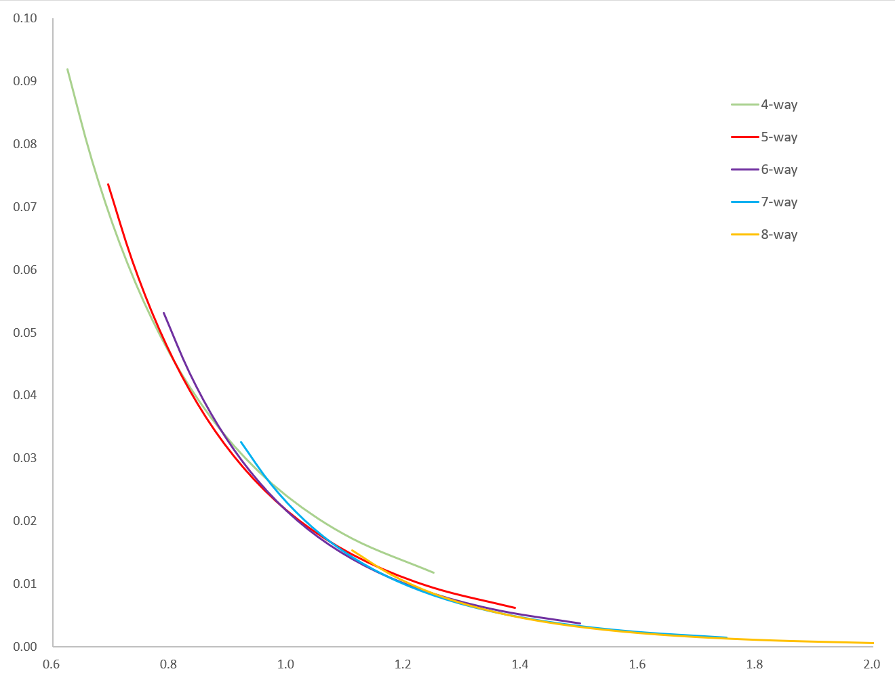

# PageBloomFilter

采用分页设计的布隆过滤器，兼顾存储密度与访问性能。

## Benchmark

在Xeon-8374C上测试50万元素，平均每次操作小于25ns，SIMD能有效加速查询操作。

在EPYC-7K83上测试表现略逊，SIMD加速效果不明显。

## 理论分析

### 每元素字节数与假阳率的关系

### 容积率与假阳率的关系

---
[【中文】](README-CN.md) [【英文】](README.md)