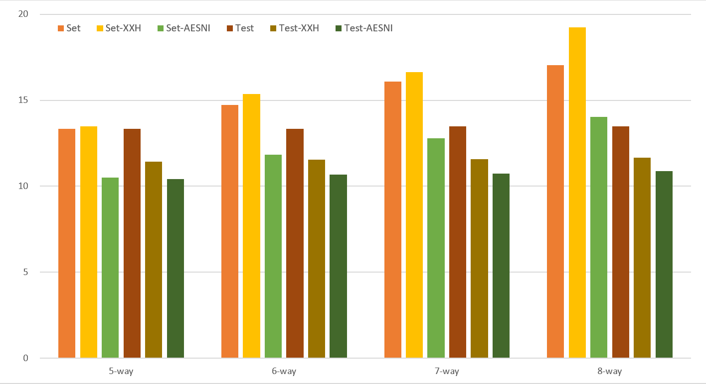
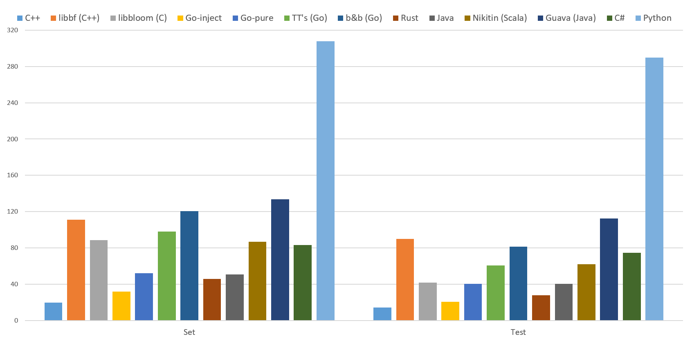
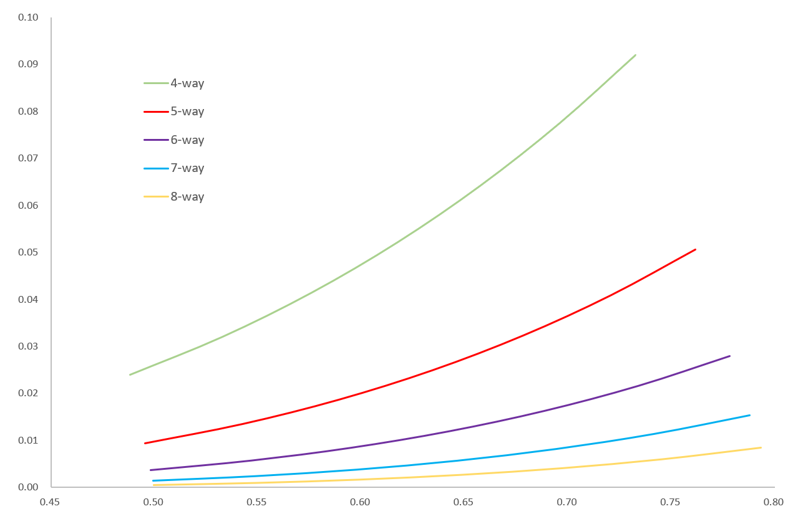

# PageBloomFilter

采用分页设计的布隆过滤器，兼顾存储密度与访问性能。

## Benchmark

在Xeon-8374C上测试50万元素，平均每次操作小于25ns，SIMD能有效加速查询操作。


在EPYC-7K83上测试表现略逊，SIMD加速效果不明显。


在Xeon-8475B上测试SIMD模式，使用aesni-hash可获得显著加速（**小于7ns的test操作**）。


在EPYC-9T24上测试SIMD模式，使用aesni-hash也可获得显著加速，但没有Intel平台上显著。

## API
```cpp
auto bf = NEW_BLOOM_FILTER(500, 0.01);
if (bf.set("Hello")) {
    std::cout << "set new Hello" << std::endl;
}
if (bf.test("Hello")) {
    std::cout << "find Hello" << std::endl;
}
```

## Go版

```go
// import "github.com/PeterRK/PageBloomFilter/go"
// 有效容量500，假阳率0.01
bf := pbf.NewBloomFilter(500, 0.01)
if bf.Set("Hello") {
    fmt.Println("set new Hello")
}
if bf.Test("Hello") {
    fmt.Println("find Hello")
}
```

除了原生实现，在AMD64环境中还提供基于**函数注入技术**的实现，具体而言就是将C函数编译后注入到Go程序中以免除CGO的调用开销。在Xeon-8374C上测试50万元素，Go注入版较原生版有一倍左右的性能提升，仅比C++版略慢。

```
name   old time/op  new time/op  delta
Set4   53.6ns ± 6%  26.5ns ± 6%  -50.52%  (p=0.000 n=20+20)
Test4  40.5ns ± 5%  21.2ns ± 5%  -47.63%  (p=0.000 n=20+18)
Set5   56.4ns ± 5%  28.0ns ± 5%  -50.34%  (p=0.000 n=20+19)
Test5  41.5ns ± 3%  18.8ns ± 7%  -54.72%  (p=0.000 n=20+19)
Set6   57.6ns ± 5%  29.1ns ± 5%  -49.44%  (p=0.000 n=20+20)
Test6  42.2ns ± 4%  18.5ns ± 7%  -56.22%  (p=0.000 n=20+18)
Set7   58.8ns ± 4%  30.8ns ± 9%  -47.68%  (p=0.000 n=20+20)
Test7  43.9ns ± 6%  18.9ns ± 8%  -56.98%  (p=0.000 n=20+19)
Set8   58.4ns ± 9%  32.4ns ± 5%  -44.53%  (p=0.000 n=20+19)
Test8  44.8ns ± 2%  18.4ns ± 7%  -58.86%  (p=0.000 n=19+20)
```

AMD64环境中注入版默认开启，编译前最好先执行[go-inject.sh](go/go-inject.sh)生成新的注入函数。注入函数生成脚本依赖clang和binutils，以及python，建议在Linux环境执行。

[测评](https://gist.github.com/PeterRK/b0df9e80caaaee1e9349e295cb435a67) 表明本实现比知名的 [bits-and-blooms](https://github.com/bits-and-blooms/bloom)和[Tyler Treat版](https://github.com/tylertreat/BoomFilters)要快2倍：
```
cpu: Intel(R) Core(TM) i7-10710U CPU @ 1.10GHz
BenchmarkPageBloomFilterSet-6            1000000                32.70 ns/op
BenchmarkPageBloomFilterTest-6           1000000                20.23 ns/op
BenchmarkBitsAndBloomSet-6               1000000               120.5  ns/op
BenchmarkBitsAndBloomTest-6              1000000                81.46 ns/op
BenchmarkTylerTreatSet-6                 1000000                98.30 ns/op
BenchmarkTylerTreatTest-6                1000000                60.69 ns/op
```

## Java版
```java
PageBloomFilter bf = PageBloomFilter.New(500, 0.01);
byte[] hello = "Hello".getBytes("UTF-8");
if (bf.set(hello)) {
    System.out.println("set new Hello");
}
if (bf.test(hello)) {
    System.out.println("find Hello");
}
```
[测评](java/src/test/java/com/github/peterrk/pbf/BloomFilterBenchmark.java) 表明本实现比Google的Guava要快很多。不过，由于缺少针对性优化，Java版没有Go版快。
```
// i7-10710U & OpenJDK-17
pbf-set:      50.962245 ns/op
pbf-test:     40.465323 ns/op
guava-set:   133.513980 ns/op
guava-test:  112.318321 ns/op
nikitin-set:  86.930928 ns/op
nikitin-test: 62.133052 ns/op
```

## C#版
```csharp
var bf = PageBloomFilter.New(500, 0.01);
var hello = Encoding.ASCII.GetBytes("Hello")
if (bf.Set(hello)) {
    Console.WriteLine("set new Hello");
}
if (bf.Test(hello)) {
    Console.WriteLine("find Hello");
}
```
C#版代码和Java版高度一致，不过跑出来要慢不少。
```
// i7-10710U & .NET-7
pbf-set:  83.461274 ns/op
pbf-test: 74.953785 ns/op
```

## Python版
```python
bf = pbf.create(500, 0.01)
if bf.set("Hello"):
    print("set new Hello")
if bf.test("Hello"):
    print("find Hello")
```
Python版基于C扩展实现，虽然还是慢，不过足以吊打[pybloom](https://github.com/jaybaird/python-bloomfilter)。
```
// i7-10710U & Python-3.11.3
pbf-set:       307.835638 ns/op
pbf-test:      289.679349 ns/op
pybloom-set:  2770.372372 ns/op
pybloom-test: 2417.377588 ns/op
```

## Rust版
```rust
let mut bf = pbf::new_bloom_filter(500, 0.01);
let hello = "Hello".as_bytes();
if (bf.set(hello)) {
    println!("set new Hello");
}
if (bf.test(hello)) {
    println!("find Hello");
}
```
Rust版也缺少针对性优化，照样快过Java。由于我是Rust新手，或许Rust版本应更快。
```
// i7-10710U & Rust-1.65.0
pbf-set:  45.99ns/op
pbf-test: 27.81ns/op
```

## 序列化与反序列化
不同语言实现的数据结构是一致，可以跨语言使用。虽然这里不提供专门的序列化和反序列化API，但也很容易实现：保存和加载`way`、`page_level`、`unique_cnt`三个参数，以及`data`的位图即可。其中`way`和`page_level`是个很小的整数， 可以分别用4bit表示。
```cpp
// C++
auto bf = pbf::New(500, 0.01);
auto bf2 = pbf::New(bf->way(), bf->page_level(), bf->data(), bf->data_size(), bf->unique_cnt());

// 示例格式（并非标准）
struct Pack {
    uint32_t way : 4;
    uint32_t page_level : 4;
    uint32_t unique_cnt : 24;
    uint32_t data_size;
    uint8_t data[0];
};
```
```go
// GO
bf := pbf.NewBloomFilter(500, 0.01)
bf2 := pbf.CreatePageBloomFilter(bf.Way(), bf.PageLevel(), bf.Data(), bf.Unique())
```
```java
// Java
PageBloomFilter bf = PageBloomFilter.New(500, 0.01);
PageBloomFilter bf2 = PageBloomFilter.New(bf.getWay(), bf.getPageLevel(), bf.getData(), bf.getUniqueCnt());
```
```csharp
// C#
var bf = PageBloomFilter.New(500, 0.01);
var bf2 = PageBloomFilter.New(bf.Way, bf.PageLevel, bf.Data, bf.UniqueCnt);
```
```python
# Python
bf = pbf.create(500, 0.01)
bf2 = pbf.restore(bf.way, bf.page_level, bf.data, bf.unique_cnt)
```
```rust
// Rust
let mut bf = pbf::new_bloom_filter(500, 0.01);
let mut bf2 = pbf::restore_pbf(bf.get_way(), bf.get_page_level(), bf.get_data(), bf.get_unique_cnt());
```


## 横向比较

我们将在i7-10710U上的测试数据放到一起看，可以得到性能排位：C++，Go，Rust，Java，C#，Python。

## 理论分析

### 每元素字节数与假阳率的关系


### 容积率与假阳率的关系


---
[【中文】](README-CN.md) [【英文】](README.md)
