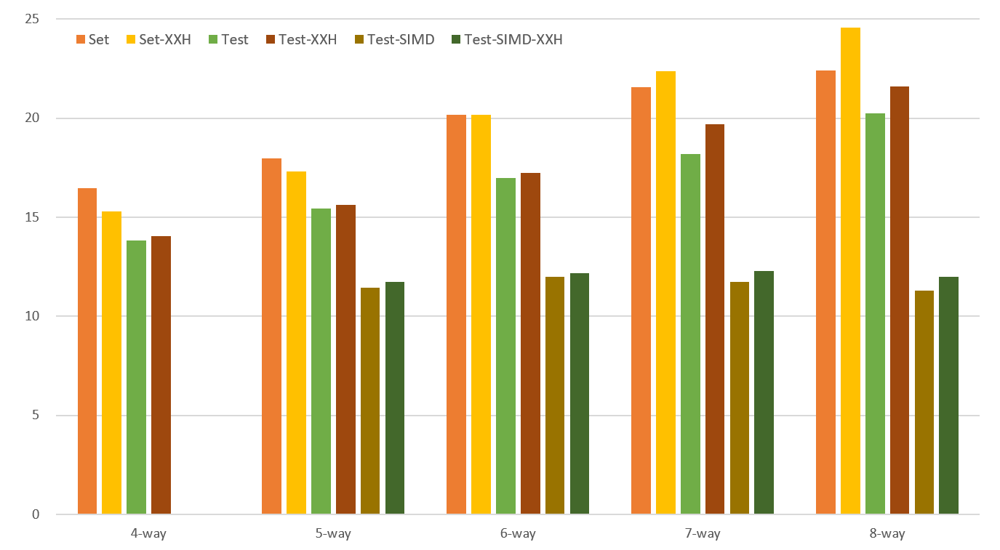
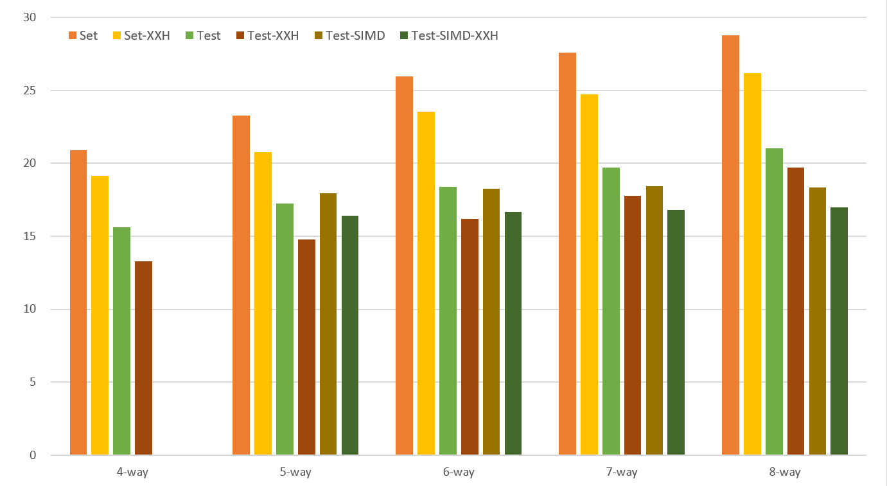
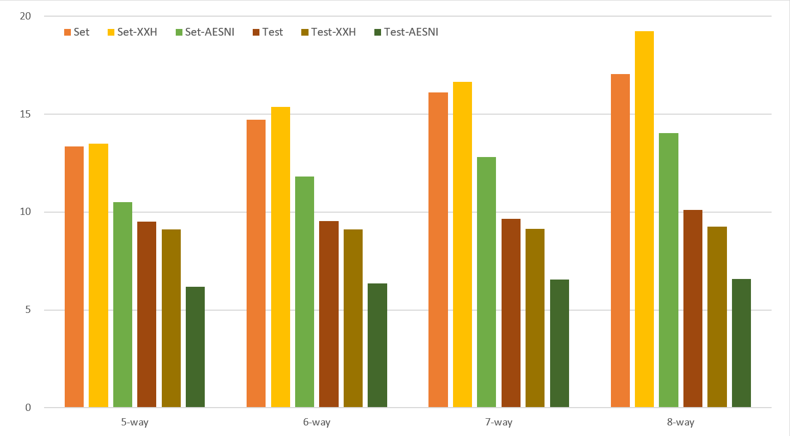
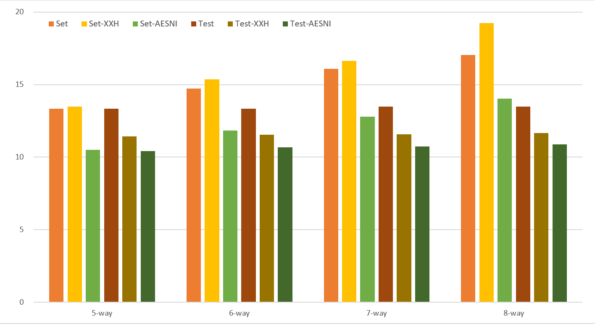
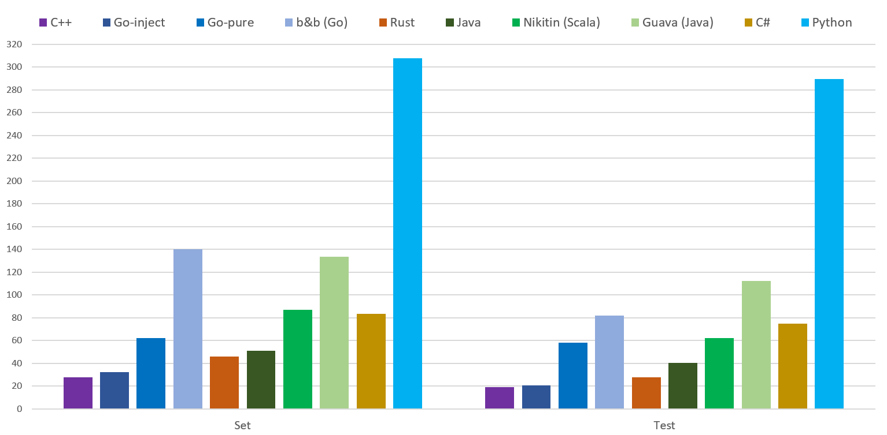
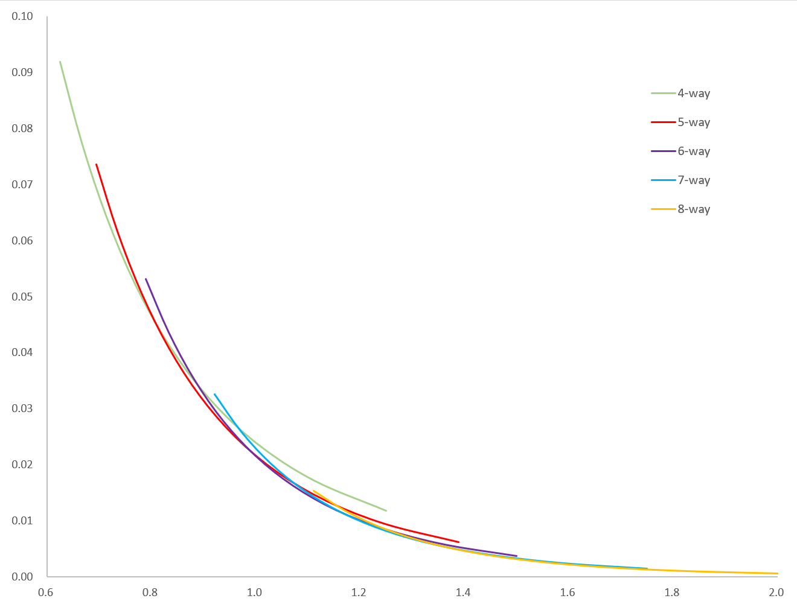
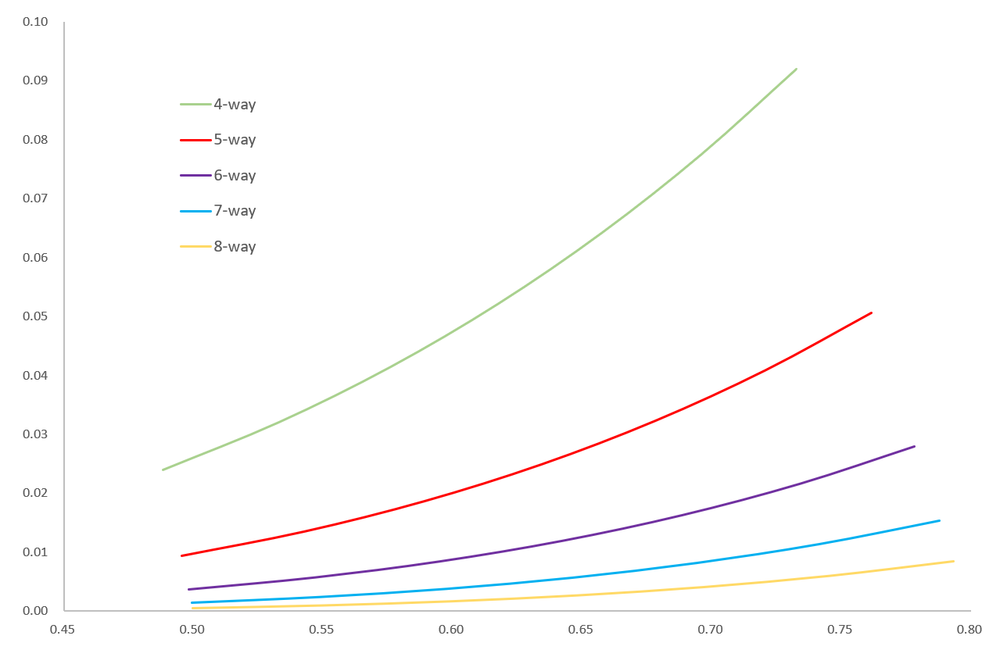

# PageBloomFilter

Bloom filter with page, designed for storage density and query speed.

## Benchmark

We got average latency per operation under 25ns in a benchmark with 500k elements on a Xeon-8374C machine. SIMD brings significant speed-up.


It runs slower on EPYC-7K83 machine.


Running test with SIMD on Xeon-8475B machine, we found aesni-hash helps a lot (**amazing fast test operation under 7ns**).


Running test with SIMD on EPYC-9T24 machine, we found aesni-hash helps a little.

## API
```cpp
auto bf = NEW_BLOOM_FILTER(500, 0.01);
if (bf.set("Hello")) {
    std::cout << "set new Hello" << std::endl;
}
if (bf.test("Hello")) {
    std::cout << "find Hello" << std::endl;
}
```

## Go Version

```go
// import "github.com/PeterRK/PageBloomFilter/go"
// BloomFilter with 0.01 false positive rate for 500 items
bf := pbf.NewBloomFilter(500, 0.01)
if bf.Set("Hello") {
    fmt.Println("set new Hello")
}
if bf.Test("Hello") {
    fmt.Println("find Hello")
}
```

**Function injection techique** is avaliable for AMD64. It uses code compiled by clang in Go without CGO. A benchmark with 500k elements on a Xeon-8374C machine shows new implement runs much fast than the pure go implement.

```
name   old time/op  new time/op  delta
Set4   53.6ns ± 6%  26.5ns ± 6%  -50.52%  (p=0.000 n=20+20)
Test4  40.5ns ± 5%  21.2ns ± 5%  -47.63%  (p=0.000 n=20+18)
Set5   56.4ns ± 5%  28.0ns ± 5%  -50.34%  (p=0.000 n=20+19)
Test5  41.5ns ± 3%  18.8ns ± 7%  -54.72%  (p=0.000 n=20+19)
Set6   57.6ns ± 5%  29.1ns ± 5%  -49.44%  (p=0.000 n=20+20)
Test6  42.2ns ± 4%  18.5ns ± 7%  -56.22%  (p=0.000 n=20+18)
Set7   58.8ns ± 4%  30.8ns ± 9%  -47.68%  (p=0.000 n=20+20)
Test7  43.9ns ± 6%  18.9ns ± 8%  -56.98%  (p=0.000 n=20+19)
Set8   58.4ns ± 9%  32.4ns ± 5%  -44.53%  (p=0.000 n=20+19)
Test8  44.8ns ± 2%  18.4ns ± 7%  -58.86%  (p=0.000 n=19+20)
```

We suggest that user should execute [go-inject.sh](pbf/go-inject.sh) to gnerate new injecting code before build. Clang, binutils and python are needed.

[Benchmark](https://gist.github.com/PeterRK/b0df9e80caaaee1e9349e295cb435a67) shows it runs 2x time faster than other famous bloom filter implements, [bits-and-blooms](https://github.com/bits-and-blooms/bloom) and [Tyler Treat's](https://github.com/tylertreat/BoomFilters):
```
cpu: Intel(R) Core(TM) i7-10710U CPU @ 1.10GHz
BenchmarkPageBloomFilterSet-6            1000000                32.70 ns/op
BenchmarkPageBloomFilterTest-6           1000000                20.23 ns/op
BenchmarkBitsAndBloomSet-6               1000000               120.5  ns/op
BenchmarkBitsAndBloomTest-6              1000000                81.46 ns/op
BenchmarkTylerTreatSet-6                 1000000                98.30 ns/op
BenchmarkTylerTreatTest-6                1000000                60.69 ns/op
```

## Java Version
```java
PageBloomFilter bf = PageBloomFilter.New(500, 0.01);
byte[] hello = "Hello".getBytes("UTF-8");
if (bf.set(hello)) {
    System.out.println("set new Hello");
}
if (bf.test(hello)) {
    System.out.println("find Hello");
}
```
[Benchmark](java/src/test/java/rk/pbf/Benchmark.java) shows it runs much faster than Google's Guava and Alexandr Nikitin's bloom-filter-scala. We see Java version without dedicated optimization is inferior to the Go version.
```
// i7-10710U & OpenJDK-17
pbf-set:      50.962245 ns/op
pbf-test:     40.465323 ns/op
guava-set:   133.513980 ns/op
guava-test:  112.318321 ns/op
nikitin-set:  86.930928 ns/op
nikitin-test: 62.133052 ns/op
```

## C# Version
```csharp
var bf = PageBloomFilter.New(500, 0.01);
var hello = Encoding.ASCII.GetBytes("Hello")
if (bf.Set(hello)) {
    Console.WriteLine("set new Hello");
}
if (bf.Test(hello)) {
    Console.WriteLine("find Hello");
}
```
C# code is very similar to Java code, but runs slower.
```
// i7-10710U & .NET-7
pbf-set:  83.461274 ns/op
pbf-test: 74.953785 ns/op
```

## Python Version
```python
bf = pbf.create(500, 0.01)
if bf.set("Hello"):
    print("set new Hello")
if bf.test("Hello"):
    print("find Hello")
```
Python with c extension is still slow, but 8x time faster than [pybloom](https://github.com/jaybaird/python-bloomfilter).
```
// i7-10710U & Python-3.11.3
pbf-set:       307.835638 ns/op
pbf-test:      289.679349 ns/op
pybloom-set:  2770.372372 ns/op
pybloom-test: 2417.377588 ns/op
```

## Rust Version
```rust
let mut bf = pbf::new_bloom_filter(500, 0.01);
let hello = "Hello".as_bytes();
if (bf.set(hello)) {
    println!("set new Hello");
}
if (bf.test(hello)) {
    println!("find Hello");
}
```
Rust verison is also lack of dedicated optimiztion, but faster than Java version a lot. I believe it sould be faster, because I am new at this language.
```
// i7-10710U & Rust-1.65.0
pbf-set:  45.99ns/op
pbf-test: 27.81ns/op
```

# Ranking

With test data on i7-10710U machine, we got performance rank: C++, Go, Rust, Java, C#, Python.

## Theoretical Analysis

### Bytes per element - False positive rate


### Occupancy rate - False positive rate


---
[【Chinese】](README-CN.md) [【English】](README.md)
