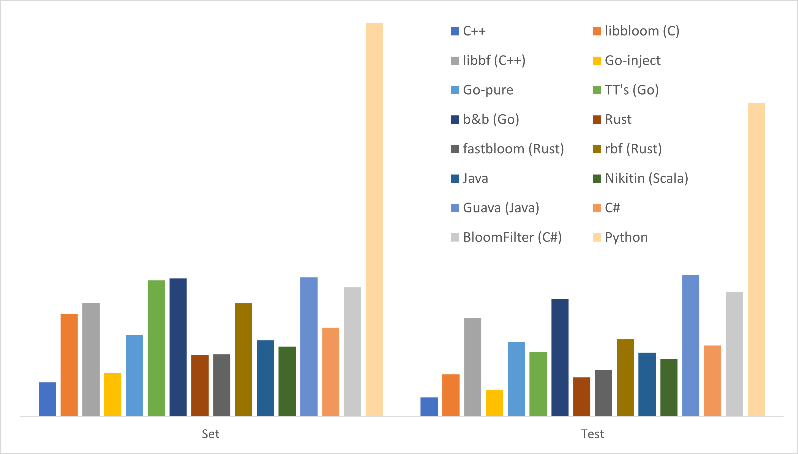

# PageBloomFilter

Bloom filter with page, designed for storage density and query speed.

## C++
```cpp
auto bf = NEW_BLOOM_FILTER(500, 0.01);
if (bf.set("Hello")) {
    std::cout << "set new Hello" << std::endl;
}
if (bf.test("Hello")) {
    std::cout << "find Hello" << std::endl;
}
```
C++ implement runs extremely fast with aesni instruction. The standard compatible version is also good enough.
```
// U7-155H & Clang-18
pbf-set:        10.9247 ns/op
pbf-test:        6.0765 ns/op
pbf-aesni-set:   8.3275 ns/op
pbf-aesni-test:  4.3405 ns/op
libbf-set:      36.6518 ns/op
libbf-test:     31.7608 ns/op
libbloom-set:   33.0665 ns/op
libbloom-test:  13.5359 ns/op
```

## Go

```go
// import "github.com/PeterRK/PageBloomFilter/go"
// BloomFilter with 0.01 false positive rate for 500 items
bf := pbf.NewBloomFilter(500, 0.01)
if bf.Set("Hello") {
    fmt.Println("set new Hello")
}
if bf.Test("Hello") {
    fmt.Println("find Hello")
}
```

**Function injection techique** is avaliable for AMD64. It uses code compiled by clang in Go without CGO. A benchmark with 500k elements on a Xeon-8374C machine shows new implement runs much fast than the pure go implement.

```
name   old time/op  new time/op  delta
Set4   53.6ns ± 6%  26.5ns ± 6%  -50.52%  (p=0.000 n=20+20)
Test4  40.5ns ± 5%  21.2ns ± 5%  -47.63%  (p=0.000 n=20+18)
Set5   56.4ns ± 5%  28.0ns ± 5%  -50.34%  (p=0.000 n=20+19)
Test5  41.5ns ± 3%  18.8ns ± 7%  -54.72%  (p=0.000 n=20+19)
Set6   57.6ns ± 5%  29.1ns ± 5%  -49.44%  (p=0.000 n=20+20)
Test6  42.2ns ± 4%  18.5ns ± 7%  -56.22%  (p=0.000 n=20+18)
Set7   58.8ns ± 4%  30.8ns ± 9%  -47.68%  (p=0.000 n=20+20)
Test7  43.9ns ± 6%  18.9ns ± 8%  -56.98%  (p=0.000 n=20+19)
Set8   58.4ns ± 9%  32.4ns ± 5%  -44.53%  (p=0.000 n=20+19)
Test8  44.8ns ± 2%  18.4ns ± 7%  -58.86%  (p=0.000 n=19+20)
```

We suggest that user should execute [go-inject.sh](go/go-inject.sh) to gnerate new injecting code before build. Clang, binutils and python are needed.

[Benchmark](https://gist.github.com/PeterRK/b0df9e80caaaee1e9349e295cb435a67) shows it runs 2x time faster than other famous bloom filter implements, [bits-and-blooms](https://github.com/bits-and-blooms/bloom) and [Tyler Treat's](https://github.com/tylertreat/BoomFilters):
```
// i7-10710U & Go-1.20
BenchmarkPageBloomFilterSet-6        1000000            32.70 ns/op
BenchmarkPageBloomFilterTest-6       1000000            20.23 ns/op
BenchmarkBitsAndBloomSet-6           1000000           120.5  ns/op
BenchmarkBitsAndBloomTest-6          1000000            81.46 ns/op
BenchmarkTylerTreatSet-6             1000000            98.30 ns/op
BenchmarkTylerTreatTest-6            1000000            60.69 ns/op

// U7-155H & Go-1.20
BenchmarkPageBloomFilterSet-16       1000000            13.95 ns/op
BenchmarkPageBloomFilterTest-16      1000000             8.40 ns/op
BenchmarkBitsAndBloomSet-16          1000000            44.57 ns/op
BenchmarkBitsAndBloomTest-16         1000000            37.94 ns/op
BenchmarkTylerTreatSet-16            1000000            43.94 ns/op
BenchmarkTylerTreatTest-16           1000000            20.80 ns/op

// U7-155H & Go-1.24 (to fix: injection is broken since Go-1.21)
BenchmarkPageBloomFilterSet-16       1000000            26.35 ns/op
BenchmarkPageBloomFilterTest-16      1000000            23.97 ns/op
```

## Java
```java
PageBloomFilter bf = PageBloomFilter.New(500, 0.01);
byte[] hello = "Hello".getBytes("UTF-8");
if (bf.set(hello)) {
    System.out.println("set new Hello");
}
if (bf.test(hello)) {
    System.out.println("find Hello");
}
```
[Benchmark](java/src/test/java/com/github/peterrk/pbf/BloomFilterBenchmark.java) shows it runs much faster than Google's [Guava](https://github.com/google/guava), but sometimes a liitle slower than Alexandr Nikitin's [bloom-filter-scala](https://github.com/alexandrnikitin/bloom-filter-scala). We see Java version without dedicated optimization is inferior to the Go version.
```
// i7-10710U & OpenJDK-17
pbfSet       50.962 ns/op
pbfTest      40.465 ns/op
guavaSet    133.514 ns/op
guavaTest   112.318 ns/op
nikitinSet   86.931 ns/op
nikitinTest  62.133 ns/op

// U7-155H & OpenJDK-21
pbfSet       24.562 ns/op
pbfTest      20.511 ns/op
guavaSet     44.889 ns/op
guavaTest    45.652 ns/op
nikitinSet   22.474 ns/op
nikitinTest  18.489 ns/op
```

## C#
```csharp
var bf = PageBloomFilter.New(500, 0.01);
var hello = Encoding.ASCII.GetBytes("Hello")
if (bf.Set(hello)) {
    Console.WriteLine("set new Hello");
}
if (bf.Test(hello)) {
    Console.WriteLine("find Hello");
}
```
C# code is very similar to Java, but runs slower. It's faster than [BloomFilter.NetCore](https://github.com/vla/BloomFilter.NetCore).
```
// i7-10710U & .NET-7
pbf-set:  83.461274 ns/op
pbf-test: 74.953785 ns/op

// U7-155H & .NET-9
pbf-set:     28.63103 ns/op
pbf-test:    22.88545 ns/op
bf.net-set:  41.66280 ns/op
bf.net-test: 40.12608 ns/op
```

## Python
```python
bf = pbf.create(500, 0.01)
if bf.set("Hello"):
    print("set new Hello")
if bf.test("Hello"):
    print("find Hello")
```
Python with c extension is still slow, but 8x time faster than [pybloom](https://github.com/jaybaird/python-bloomfilter).
```
// i7-10710U & Python-3.11
pbf-set:       307.835638 ns/op
pbf-test:      289.679349 ns/op
pybloom-set:  2770.372372 ns/op
pybloom-test: 2417.377588 ns/op

// U7-155H & Python-3.12
pbf-set:  127.227066 ns/op
pbf-test: 101.274176 ns/op
```

## Rust
```rust
let mut bf = pbf::new_bloom_filter(500, 0.01);
let hello = "Hello".as_bytes();
if (bf.set(hello)) {
    println!("set new Hello");
}
if (bf.test(hello)) {
    println!("find Hello");
}
```
Rust verison is also lack of dedicated optimiztion, but faster than Java version a lot. It shows some advantage in performance against [fastbloom](https://github.com/tomtomwombat/fastbloom) and [rust-bloom-filter](https://github.com/jedisct1/rust-bloom-filter).
```
// i7-10710U & Rust-1.65
pbf-set:  45.99ns/op
pbf-test: 27.81ns/op

// U7-155H & Rust-1.80
pbf-set:        19.85ns/op
pbf-test:       12.50ns/op
fastbloom-set:  19.97ns/op
fastbloom-test: 14.93ns/op
rbf-set:        36.51ns/op
rbf-test:       24.93ns/op
```

## Ranking

With test data on U7-155H machine, we got performance rank: C++, Go, Rust, Java, C#, Python.

## Serialize & Deserialize
Data structures of different implements, except C++ with aesni, are consistent, so you can do cross-language serializing and deserializing without dedicated serialize & deserialize APIs. Just save and restore 3 scalar parameters `way`, `page_level`, `unique_cnt`, and the `data` bitmap. Values of `way` and `page_level` are always tiny integers, which can be represented by 4 bit.
```cpp
// C++
auto bf = pbf::New(500, 0.01);
auto bf2 = pbf::New(bf->way(), bf->page_level(), bf->data(), bf->data_size(), bf->unique_cnt());

// A example (not standard) format
struct Pack {
    uint32_t way : 4;
    uint32_t page_level : 4;
    uint32_t unique_cnt : 24;
    uint32_t data_size;
    uint8_t data[0];
};
```
```go
// GO
bf := pbf.NewBloomFilter(500, 0.01)
bf2 := pbf.CreatePageBloomFilter(bf.Way(), bf.PageLevel(), bf.Data(), bf.Unique())
```
```java
// Java
PageBloomFilter bf = PageBloomFilter.New(500, 0.01);
PageBloomFilter bf2 = PageBloomFilter.New(bf.getWay(), bf.getPageLevel(), bf.getData(), bf.getUniqueCnt());
```
```csharp
// C#
var bf = PageBloomFilter.New(500, 0.01);
var bf2 = PageBloomFilter.New(bf.Way, bf.PageLevel, bf.Data, bf.UniqueCnt);
```
```python
# Python
bf = pbf.create(500, 0.01)
bf2 = pbf.restore(bf.way, bf.page_level, bf.data, bf.unique_cnt)
```
```rust
// Rust
let mut bf = pbf::new_bloom_filter(500, 0.01);
let mut bf2 = pbf::restore_pbf(bf.get_way(), bf.get_page_level(), bf.get_data(), bf.get_unique_cnt());
```

## Detail Benchmark

We got average latency per operation under 25ns in a benchmark with 500k elements on a Xeon-8374C machine. SIMD brings significant speed-up.


It runs slower on EPYC-7K83 machine.


Running test with SIMD on Xeon-8475B machine, we found aesni-hash helps a lot (**amazing fast test operation under 7ns**).


Running test with SIMD on EPYC-9T24 machine, we found aesni-hash helps a little.

## Theoretical Analysis

### Bytes per element - False positive rate


### Occupancy rate - False positive rate


---
[【Chinese】](README-CN.md) [【English】](README.md)
